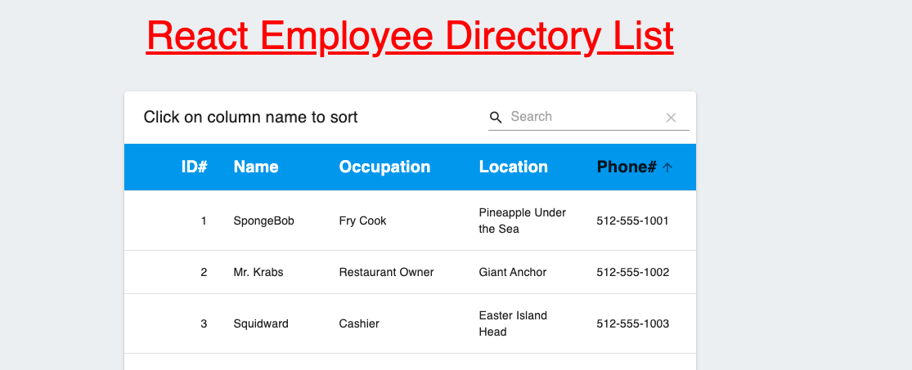

# 19-Employee_Directory

## Overview

For this assignment, you'll create a employee directory with React. This assignment will require you to break up your application's UI into components, manage component state, and respond to user events.

## User Story

```diff
+ As a manager,
+
+ I want to be able to view my entire employee directory at once 
+
+ So that I have quick access to their information.
```

## Business Context

An employee or manager would benefit greatly from being able to view non-sensitive data about other employees. Employee list can be sorted by clicking on column header.

## Screen Shot

